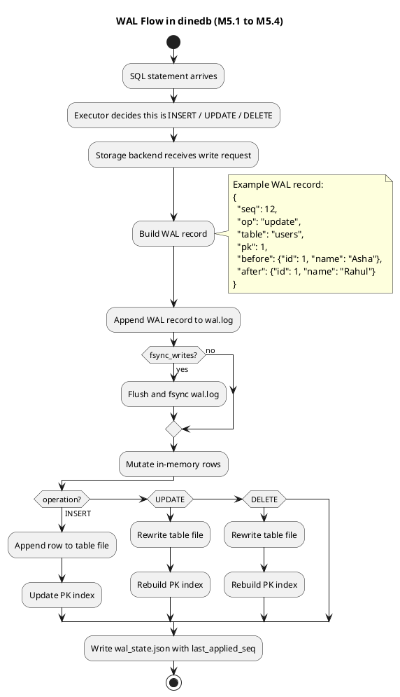
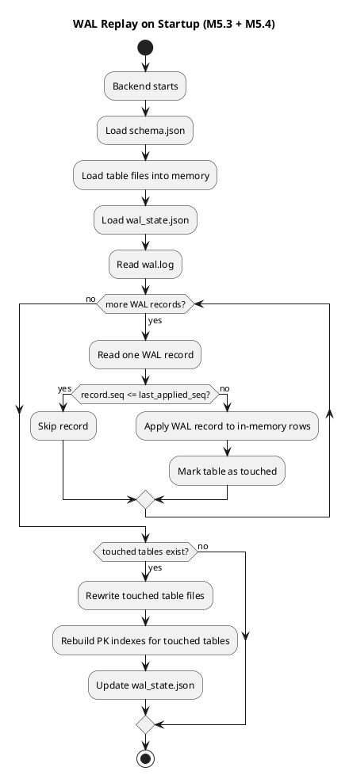

# WAL, Recovery, and Rollback: The Feature That Makes a Database Trustworthy

## The Lame Analogy
A cashier writes every sale in a receipt book before putting money in the drawer. If the machine crashes, the receipt book is still the source of truth.

That receipt book is the write-ahead log.

## The Technical Bridge
The core challenge we face here is partial failure. A process can crash:
- after writing table data but before updating the index
- after updating metadata but before flushing the row
- after mutating in-memory state but before persisting anything

Without a log, you do not know what the system intended to do.

That is the harsh reality of persistence. A database does not fail only at the edges. It fails between steps.

This is also where beginner confidence usually breaks. Everything works on the happy path until one power loss or process kill reveals that the engine has no durable story.

## WAL in One Sentence
Write the intent to a sequential log first. Only then touch the main data files.

## What Real Databases Like PostgreSQL, InnoDB, and SQLite Actually Do
Production databases do not rely on a single trick. They combine multiple mechanisms:

- **WAL / redo log** for durable intent
- **checkpoints** to bound restart time
- **redo recovery** to reapply missing durable changes
- **undo or MVCC cleanup** to deal with incomplete transactions
- **fsync / durable flush discipline** before acknowledging critical state transitions

Examples:
- **PostgreSQL**: WAL + checkpoints + crash recovery replay
- **MySQL InnoDB**: redo log + undo log + checkpoint metadata
- **SQLite**: rollback journal or WAL mode

This article follows the same progression in a smaller, learning-first form.

## One End-to-End Example We Will Reuse
Suppose the application executes:

```sql
UPDATE users SET name = 'Rahul' WHERE id = 1;
```

Assume the current row is:

```json
{"id": 1, "name": "Asha"}
```

The desired final row is:

```json
{"id": 1, "name": "Rahul"}
```

Every M5 milestone is really answering one question:

- how do we remember this update?
- how do we order the steps safely?
- how do we recover after a crash?
- how do we avoid replaying too much?
- how do we prove the recovery path actually works?

## WAL Flow in UML
This is the current WAL flow in `dinedb` for `INSERT`, `UPDATE`, and `DELETE`:



## Milestone-by-Milestone Build

## M5.1 WAL Record Format

### Definition
A WAL record is the durable description of one logical change before the real table and index files are changed.

In `dinedb`, the WAL record is currently JSONL.

Example:

```json
{
  "seq": 12,
  "format": "jsonl-v1",
  "op": "update",
  "table": "users",
  "pk": 1,
  "before": {"id": 1, "name": "Asha"},
  "after": {"id": 1, "name": "Rahul"}
}
```

### Problem We Are Solving
Without a record like this, the engine loses the most important fact during a crash: **intent**.

If the process dies halfway through an update, the storage files alone cannot answer:
- what operation was happening
- which row was affected
- what the old state was
- what the intended new state was

### Our Mini-DB Solution
We record:
- operation type
- target table
- primary key
- `before` row image
- `after` row image
- monotonic sequence number

That gives replay enough information to rebuild the correct state.

### Tradeoff
- **Chosen now:** JSONL WAL because it is inspectable and easy to debug
- **Alternative later:** binary WAL for smaller records, tighter layouts, lower parse overhead

The senior insight here is that optimizing the record format too early hides the semantics. First we need to understand the recovery rules. Only then is binary encoding worth the complexity.

### Real Database Example
- PostgreSQL stores binary WAL records internally
- InnoDB stores redo log records in binary form
- SQLite WAL mode also uses a structured binary log format

### Real-World Example
In a payment system, if an order state changes from `authorized` to `captured`, the engine must remember the intended transition even if the process crashes before the main tables are fully updated.

### Bottom Line
`M5.1` gives the database a memory of intent.

## M5.2 Write-Ahead Discipline

### Definition
Write-ahead discipline means the log entry is written before the main data files are changed.

The correct order is:

1. build WAL record
2. append WAL record
3. flush WAL if durability requires it
4. mutate table file / index
5. mark progress later

### Problem We Are Solving
If the database writes the table file first and crashes before the log is durable, restart has no trustworthy explanation for what happened.

That is the core failure. It is not enough to have a log. The **ordering** of writes is the feature.

### Our Mini-DB Solution
For `INSERT`, `UPDATE`, and `DELETE`, `dinedb` appends the WAL record first and only then mutates the table and PK index.

For our running example:

```text
build update record for users.id=1
-> append to wal.log
-> optionally fsync wal.log
-> rewrite users table state
-> rebuild users.pk.json
```

### Tradeoff
- **Benefit:** deterministic recovery after interruption
- **Cost:** extra write amplification and hot-path I/O

Alternative:
- direct file rewrite + atomic rename only

That works for some tiny systems, but it is weak for transactional recovery because it does not separate “what we intended” from “what finished”.

### Real Database Example
- PostgreSQL requires WAL to be durable before commit is acknowledged
- InnoDB follows the same fundamental write-ahead principle with redo logs

### Real-World Example
In ride-hailing, a trip assignment written to the main table before the recovery log is durable can leave dispatch state ambiguous after a crash.

### Bottom Line
`M5.2` is where the log becomes trustworthy, not just present.

## M5.3 WAL Replay on Startup

### Definition
Replay means reading WAL on restart and applying durable-but-missing changes so the data files catch up to the intended state.

### Problem We Are Solving
A WAL file that is never read during restart is only an audit trail. It is not a recovery mechanism.

After a crash, the system may have:
- WAL entry present
- table file stale
- index stale or partially rebuilt

Startup must reconcile that.

### Our Mini-DB Solution
On backend startup, `dinedb` does this:

1. load schema and table files
2. load WAL state metadata
3. scan `wal.log`
4. replay unapplied records into in-memory rows
5. rewrite touched table files
6. rebuild PK indexes for touched tables

### Running Example
Crash scenario:

```text
WAL says: update users id=1 from Asha to Rahul
table file still says: Asha
process dies
restart happens
```

Replay result:

```text
startup reads WAL
-> applies after-image {id:1, name:"Rahul"} in memory
-> rewrites table file
-> rebuilds PK index
```

Now durable state matches intended state.

### Tradeoff
- **Benefit:** recovery becomes automatic
- **Cost:** startup logic is more complex, and replay time grows as the WAL grows

Alternative:
- use WAL only for debugging

That is operationally weak. Serious systems need automatic restart repair.

### Real Database Example
- PostgreSQL replays WAL during crash recovery
- InnoDB scans redo logs during recovery
- SQLite WAL mode merges or checkpoints persisted log state

### Real-World Example
For an e-commerce checkout service during peak traffic, replay is what lets the service restart without manually comparing live orders to disk state.

### Bottom Line
`M5.3` turns WAL from a notebook into an actual recovery engine.

## M5.4 Applied-State Tracking via `wal_state.json`

### Definition
Applied-state tracking records how far recovery has already safely progressed.

In `dinedb`, that is currently:

```json
{"last_applied_seq": 12}
```

### Problem We Are Solving
Without progress tracking, startup has to replay the full WAL every time. That is easy to reason about, but it scales poorly as the log grows.

### Our Mini-DB Solution
Each WAL record has a `seq`.

Startup rule:
- if `record.seq <= last_applied_seq`, skip it
- if `record.seq > last_applied_seq`, replay it

For our running example:

```text
seq 10 insert user 1
seq 11 update user 1 name=Asha
seq 12 update user 1 name=Rahul
wal_state.json says last_applied_seq=11
```

Restart only needs to apply:
- `seq 12`

### Tradeoff
- **Benefit:** bounded replay cost
- **Cost:** one more correctness-sensitive metadata file

Important precision:
- this is a **mini checkpoint boundary**
- it is **not** a full PostgreSQL-style checkpoint subsystem

Alternative:
- full replay on every restart

That is simpler, but the operational cost keeps growing.

### Real Database Example
- PostgreSQL uses checkpoints and WAL positions to narrow recovery windows
- InnoDB uses checkpoint metadata to limit redo work

### Real-World Example
In banking or order-management systems, “correct restart” is not enough. Recovery also has to be fast enough to reduce outage duration.

### Bottom Line
`M5.4` makes restart cost controllable instead of unbounded.

## M5.5 Crash Recovery Tests

### Definition
Crash recovery tests simulate partial failures and verify that restart reconstructs the correct state.

### Problem We Are Solving
Recovery code is exactly where happy-path confidence breaks down. The real bugs live in interrupted states:
- WAL written, table stale
- table written, applied-state metadata stale
- delete logged, delete incomplete

### Our Mini-DB Solution
`dinedb` now includes targeted crash tests for cases like:

1. WAL exists, table write never happened
2. data is durable, but `wal_state.json` is stale
3. delete intent exists in WAL, but delete never finished

These tests do not just assert correctness. They log the failure boundary, the restart, and the recovered row state.

### Tradeoff
- **Happy-path tests:** easier to write, weak at proving recovery
- **Crash simulation tests:** awkward to set up, but they test the actual trust boundary

### Real Database Example
PostgreSQL and InnoDB invest heavily in recovery-path testing because crash recovery bugs are incident-grade failures.

### Real-World Example
In payments, ordering, and food delivery, the real question after a crash is not “did the code run?” It is “did restart reconstruct the right business state without human repair?”

### Bottom Line
`M5.5` is where recovery stops being a design and becomes evidence.

## A More Concrete Failure Case
Take this sequence:

1. append updated row to table file
2. start rebuilding PK index
3. process crashes

Now the system may restart into an impossible state:
- table contents changed
- index still points to old state
- application does not know whether the write should be treated as committed

WAL fixes this by separating intent from application.

The durable truth becomes:
- what was intended
- what was committed
- what still needs replay

## The Pro Definition
WAL is a sequential intent log that provides atomicity and durability and enables recovery replay.

This is what turns “files on disk” into “recoverable state.”

## Senior Insight
WAL adds write amplification. That is the cost of trust.

If you log every mutation before applying it, the write path becomes longer. But in return you get:
- deterministic recovery
- rollback foundation
- better operational clarity after crashes
- sequential I/O patterns that are often friendlier than random state repair

That trade is almost always worth it in a real transactional system.

## Why JSONL WAL Now and Binary WAL Later
This project has to balance two goals:
- learn the recovery model clearly
- move toward production-style architecture over time

That is why the first WAL format should be **JSONL**, not binary.

### Why JSONL first
JSONL gives us:
- direct inspectability
- easy debugging after simulated crashes
- clear visibility into `before` and `after` state
- simple tooling during the learning phase

If a write fails halfway through, we can open the log and see exactly what the engine intended to do. That is extremely valuable while the recovery rules are still being designed.

### What we lose with JSONL
JSONL WAL is expensive compared to binary WAL:
- larger on disk
- slower to parse
- more CPU spent serializing/deserializing
- weaker control over byte-level layout

At scale, this becomes a bottleneck because the WAL sits on the hot write path. Every extra byte and every extra parse step compounds.

### Why binary later
Binary WAL is the production-oriented direction because it improves:
- space efficiency
- parse cost
- flush throughput
- control over record layout and checksums

But binary WAL hides the meaning of the log behind encoding and decoding logic. If we adopt it too early, we start optimizing the representation before we fully understand the semantics.

### The real tradeoff
The tradeoff is not “good format vs bad format.”

The tradeoff is:
- **JSONL now** for visibility and learning
- **binary later** for efficiency once replay, checkpointing, and rollback semantics are stable

That sequencing is deliberate. Correctness first, format optimization later.

## Alternative Approaches
### 1. Full file rewrite with atomic rename
This is simple and often good enough for tiny systems.

Problem:
- expensive for large files
- does not naturally give rollback semantics
- does not separate intent from application

### 2. Shadow paging
Write new versions elsewhere and atomically swap pointers.

Problem:
- more complex space management
- less aligned with the standard OLTP mental model engineers expect

### 3. Journaling
Store enough information to repair or finalize writes.

Problem:
- similar goals, different mechanics
- still requires disciplined recovery logic

WAL is the best next step for this project because it teaches both durability and recovery in the most industry-relevant way.

## Where Rollback Fits
Rollback is not magic. It is the ability to reverse uncommitted intent using the log.

That means you need enough information in the log to undo or redo safely.

If the log is too weak, rollback becomes guesswork. A database cannot afford guesswork here.

## Recovery
Recovery means:
- load base state
- read log
- determine what was committed
- redo committed work
- undo incomplete work if needed

At small scale, replay can be simple.
At larger scale, log growth becomes an issue.

That is why production engines add:
- checkpoints
- LSN tracking
- log truncation rules
- crash-state transitions

## Why Startup Replay Comes Before Full Checkpointing
In a learning database, the first useful recovery model is often the simplest one:
- load current durable files
- read the WAL from the beginning
- reapply intent in a way that is safe even if some work already reached disk

That is called **idempotent replay**.

It is not the most efficient model, but it is the clearest one. It teaches the essential truth:
recovery is about reconstructing the correct final state, not guessing where the crash happened.

### The tradeoff
- **Replay everything:** easier to reason about, slower as the log grows
- **Track applied LSNs and checkpoints:** faster startup, more metadata and bookkeeping complexity

That is why replay comes first and checkpointing comes after. Semantics first. Cost control second.

## Startup Replay in UML
This is the startup recovery path after `M5.3` and `M5.4`:



### Real Database Example
PostgreSQL does not replay its entire lifetime of WAL on every restart. It uses checkpoints and WAL positions to narrow the recovery window.

InnoDB does something conceptually similar with redo-log state and checkpoint metadata.

### Real-World Example
Think about a payment system or food-delivery backend after a crash. The business does not just care that recovery is correct. It also cares that recovery finishes quickly enough for service to come back online.

That is why bounded replay matters. Correct but unbounded startup time is still an operational problem.

## What Breaks in Production
Without WAL and recovery discipline:
- acknowledged writes may vanish
- table and index state diverge
- startup becomes uncertain instead of deterministic
- engineers repair data manually under stress

This is where reliability stops being a feature and becomes the product itself.

## Why Crash Simulation Tests Matter
At this point, the database may look correct under normal execution and still fail under interruption.

That is why `M5.5` exists. Recovery code must be tested against states like:
- WAL appended, but table file not updated
- table file updated, but applied-state metadata stale
- delete or update half-finished when the process died

### The tradeoff
- **Happy-path tests:** easy to write, poor at proving recovery
- **Crash simulation tests:** awkward to write, but they target the real trust boundary

### Real database example
PostgreSQL, InnoDB, and other serious engines invest heavily in recovery-path validation because these are the failures that turn into incidents.

### Real-world example
In payments, ordering, and banking systems, a crash is survivable only if restart reconstructs the correct state without human repair.

That is why crash testing is not “extra QA.” It is part of the feature.

## How It Maps to Our Toy Database
In `dinedb`, WAL sits in the file-backed backend and covers:
- `INSERT`
- `UPDATE`
- `DELETE`

The durable order becomes:
1. append WAL record
2. flush WAL if needed
3. change table file
4. rebuild or update index
5. record that WAL entry is applied or checkpointed later

That is the first serious step toward ACID.

In the learning phase, those WAL records can be JSON objects written one per line.
Later, once replay and checkpoint rules are stable, the same logical WAL can move to a binary format without changing the high-level recovery model.

For `M5.3`, the recovery model is:
- replay the full JSONL WAL on startup
- apply changes idempotently
- rewrite touched tables and rebuild indexes from recovered in-memory state

For `M5.4`, we add:
- record sequencing
- `wal_state.json`
- skip already-applied records during restart

That is intentionally simple. It is the recovery model you can still explain line by line.

## Milestone Summary

- **M5.1**: define the durable change record
- **M5.2**: enforce log-before-data ordering
- **M5.3**: replay missing durable work on startup
- **M5.4**: track applied WAL progress so restart cost stays bounded
- **M5.5**: prove the recovery path with crash simulation tests

## A Useful Mental Model
The data file is not enough.

The data file tells you what is there now.
The WAL tells you what happened, what was intended, and what must be repaired.

That difference is what makes post-crash recovery possible.

## Bottom Line
The difference between a durable toy and a real database is not syntax. It is recovery discipline.
